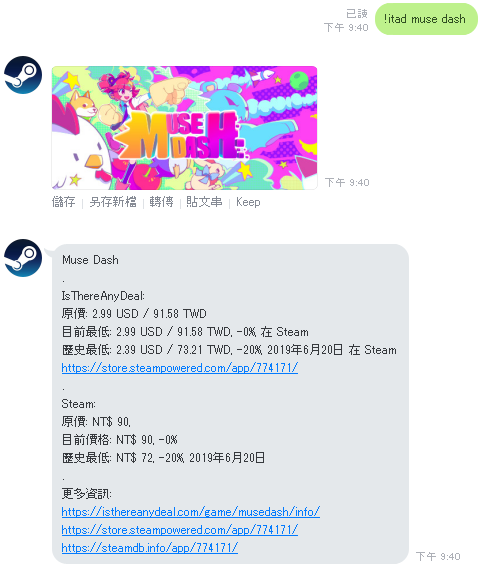

# Deals Line Bot
A linebot to get deals information form [isthereanydeal.com](https://isthereanydeal.com)  
  
  
  
## Install
- Create a `.env` file and add the following settings.
  ```
    # Your linebot channel id
    CHANNEL_ID=""

    # Your linebot channel secret
    CHANNEL_SECRET=""

    # Your linebot channel token
    CHANNEL_ACCESS_TOKEN=""

    # Your linebot app listen port
    PORT=""

    # Your isthereanydeal API key
    ITAD_KEY=""
  ```

- Run `npm install` to install dependencies.
- Run `npm start` to start your bot.
  
## Usage
- Add your bot as friend or invite it to your group
- You can use command `!itad <gamename>` to get deals info of the game.